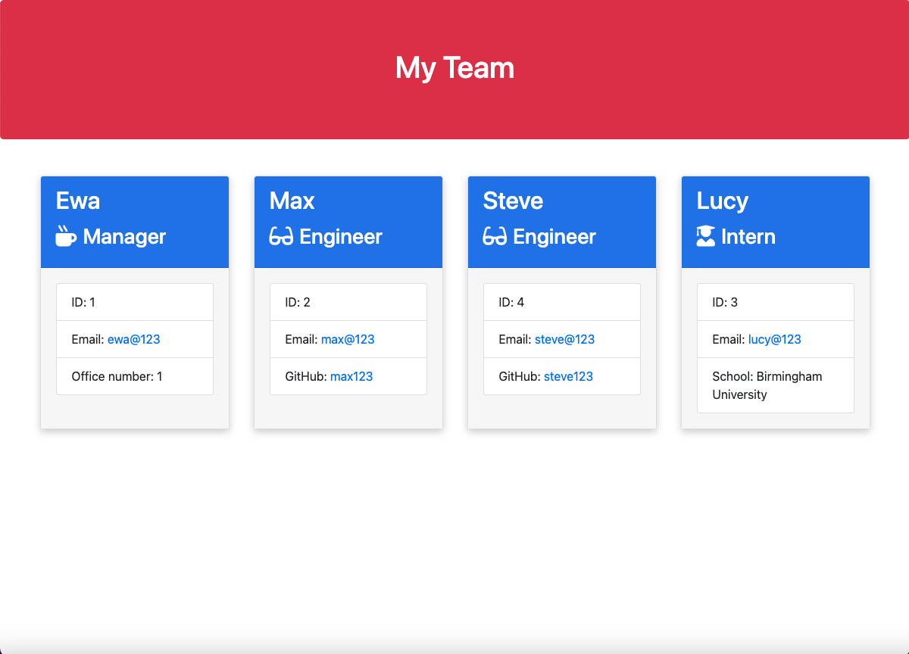

# Team-Profile-Generator
 

  ## Description
A Node.js command-line application. It takes in information about employees on a software engineering team, then generate an HTML webpage that displays summaries for each person.

  ## Deployed website screenshot
 
 

  ## Table of Contents
  * [Installation](#installation)
  * [Usage](#usage)
  * [License](#license)
  * [Contributing](#contributing)
  * [Tests](#tests)
  * [Questions](#questions)

 ## Video Demo
 Please see how the app works here: https://drive.google.com/file/d/1cxxAX91NorOYYtiTjFht-WPAUKSSbB7j/view?usp=sharing  
  ## Installation

  To install necessary dependecies, run the following command:
  ```
  npm install
  ```

  Then to run the app run
```
  Node index.js
```

This should start the app & ask you for the manager details. After entering the details of the manager you will have the optiton to add an Enginner, add an Intern or Finish building team. Choosing an option to add another team member will start another round of questions, asking you for the team member's details. If you choose to Finish building team, the app will generate a new HTML website in the output folder. This website will then contain cards with all your team members and their details.
  ## Usage
  
  What you should know before using this app: 
  This was made with Node v16.13.0 and Inquirer v^6.5.2 and Jest ^29.5.0. Please be aware that if you're using a newer version of Node, you might get error messages about the require() function.

  ## License

  This project uses the MIT license

  ## Contributing

  Before contributing to the repo please send me an email, I'd love to see what you've done!

  ## Tests

  To run tests on this project, run the following command:
  ```
  npm test
  ```
  ## Credits
  This was the first time I used validation with inquirer, and I based my function & how I validate user input on the example shown here: https://stackoverflow.com/questions/2647867/how-can-i-determine-if-a-variable-is-undefined-or-null

  ## Questions

  If you have any questions, please email me at ewagorka99@gmail.com.
  Or you can find me through github: https://github.com/ewagorka.
